# System Design
System design is the process of planning and structuring the architecture of a software system based on user requirements. It defines how different components of the system will work together to achieve the desired functionality efficiently.
[!ref](https://roadmap.sh/system-design)

## Introduction
### What is System Design
- System design is the process of defining the elements of a system, as well as their interactions and relationships, in order to satisfy a set of specified requirements.
- It involves taking a problem statement, breaking it down into smaller components and designing each component to work together effectively to achieve the overall goal of the system. This process typically includes analyzing the current system (if any) and determining any deficiencies, creating a detailed plan for the new system, and testing the design to ensure that it meets the requirements. It is an iterative process that may involve multiple rounds of design, testing, and refinement.
- In software engineering, system design is a phase in the software development process that focuses on the high-level design of a software system, including the architecture and components
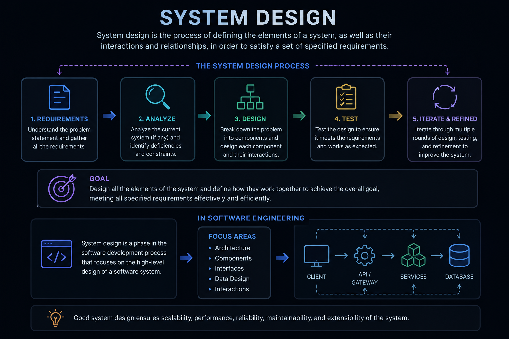

### How To: System Design?
- **Understand the problem:** Gather information about the problem you are trying to solve and the requirements of the system. Identify the users and their needs, as well as any constraints or limitations of the system.
- **Identify the scope of the system:** Define the boundaries of the system, including what the system will do and what it will not do.
- **Research and analyze existing systems:** Look at similar systems that have been built in the past and identify what worked well and what didn't. Use this information to inform your design decisions.
- **Create a high-level design:** Outline the main components of the system and how they will interact with each other. This can include a rough diagram of the system's architecture, or a flowchart outlining the process the system will follow.
- **Refine the design:** As you work on the details of the design, iterate and refine it until you have a complete and detailed design that meets all the requirements.
- **Document the design:** Create detailed documentation of your design for future reference and maintenance.
- **Continuously monitor and improve the system:** The system design is not a one-time process, it needs to be continuously monitored and improved to meet the changing requirements.
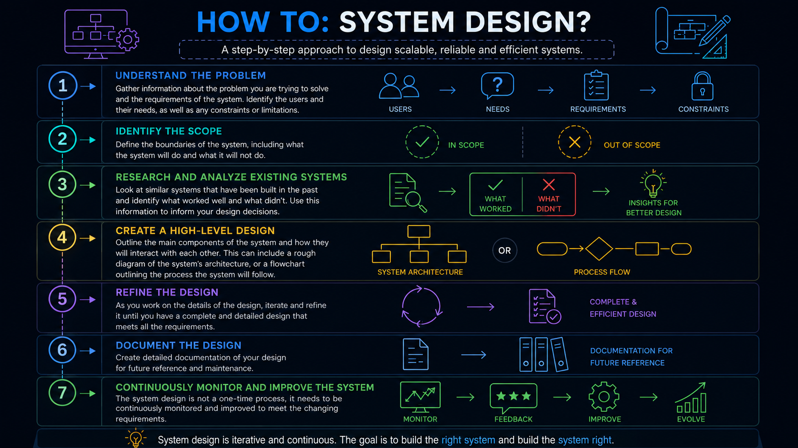

## Importance of System Design
- System design is important for anyone who wants to build a robust, scalable, and efficient software application. 
- Whether you are building a small-scale application or a large one, understanding system design allows you to architect solutions that can handle real-world complexities.

- **Scalability and Reliability:** System design ensures systems can grow and handle increased demand without failure.
- **Efficient Resource Management:** It helps in optimizing resource allocation, ensuring fast and responsive applications.
- **Adaptability:** System design enables the creation of systems that can evolve with changing business needs, reducing long-term costs.
- **Architectural Understanding:** Learning different system architectures (e.g., microservices, monolithic) helps in building applications suited to various needs.

## Performance vs Scalability
A service is scalable if it results in increased performance in a manner proportional to resources added. Generally, increasing performance means serving more units of work, but it can also be to handle larger units of work, such as when datasets grow.

Another way to look at performance vs scalability:
- If you have a performance problem, your system is slow for a single user.
- If you have a scalability problem, your system is fast for a single user but slow under heavy load.

In system design, **Performance** and **Scalability** are often used interchangeably, but they solve two entirely different problems.

Here is the straightforward distinction:

* **Performance** is about doing the *same* amount of work, but doing it *faster*.
* **Scalability** is about doing *more* work, while maintaining the *same* acceptable speed.

### 1. Performance: The "Speed" Metric

Performance measures how efficiently your system processes a single unit of work. If a user clicks a button, how fast does the response come back?

If your application is slow, it suffers from a performance problem.

**Key Metrics:**

* **Latency:** The time it takes to process a single request from start to finish (e.g., 50 milliseconds).
* **Throughput:** The amount of work done in a specific timeframe (e.g., 500 requests per second). While throughput overlaps with scalability, performance focuses on maximizing the throughput of your *existing* resources.

**How to Improve Performance (Optimization):**
You improve performance by optimizing the code, queries, or architecture to do less unnecessary work.

* **Database Tuning:** Adding the correct indexes to a PostgreSQL table so a query scans 10 rows instead of 1,000.
* **Algorithmic Efficiency:** Changing an $O(N^2)$ algorithm to $O(N \log N)$ in your Python code so data processing takes a fraction of the time.
* **Caching:** Storing frequently accessed data (like LLM configurations or static query results) in memory (e.g., Redis) to bypass expensive database hits.
* **Connection Pooling:** Reusing database connections instead of opening and closing a new one for every request.

**Example:**
Imagine you have an AI agent built with LangGraph that retrieves data. If the node execution takes 3 seconds because it does a slow, unindexed database search, adding more servers won't fix it. The request will still take 3 seconds. By adding a database index and implementing a cache, you reduce the execution time to 200 milliseconds. That is a **performance** upgrade.

### 2. Scalability: The "Capacity" Metric

Scalability measures your system's ability to handle increasing amounts of load (traffic, data volume, or concurrent users) without degrading performance.

If your application works perfectly for 100 users but crashes or slows to a crawl when 10,000 users log in, you have a scalability problem.

**Types of Scalability:**

* **Vertical Scaling (Scale-Up):** Adding more power to an existing machine. Upgrading your server from 16GB of RAM and 4 CPU cores to 64GB of RAM and 16 CPU cores. It's the easiest approach but has a hard physical limit and can become very expensive.
* **Horizontal Scaling (Scale-Out):** Adding more machines to the resource pool. Instead of one massive server, you deploy your application across 10 smaller Docker containers behind a load balancer. This approach offers nearly infinite scale.

**How to Improve Scalability (Architecture):**
You improve scalability by distributing the workload.

* **Load Balancing:** Distributing incoming API traffic evenly across multiple server instances.
* **Database Replication:** Creating "read replicas" of your database so multiple servers can handle read-heavy traffic simultaneously.
* **Database Sharding:** Splitting a massive database into smaller, distinct chunks distributed across different machines.
* **Stateless Architecture:** Designing applications so that any server can handle any request, meaning you can spin up or tear down containers on demand without losing user session data.

**Example:**
Your newly optimized LangGraph agent is now incredibly fast (200ms). However, your company launches a massive marketing campaign, and suddenly 5,000 users are hitting the endpoint simultaneously. Your single server's CPU hits 100%, and requests start queuing up or timing out. To fix this, you spin up 5 more identical Docker containers and route traffic through a load balancer. The system handles the 5,000 users effortlessly. That is a **scalability** upgrade.

---

### The Trade-off: Performance vs. Scalability

You can have one without the other, which is why system design requires balancing both.

| Scenario                              | What It Looks Like                                                                                                                                                                       | The Fix                                                            |
| ------------------------------------- | ---------------------------------------------------------------------------------------------------------------------------------------------------------------------------------------- | ------------------------------------------------------------------ |
| **High Performance, Low Scalability** | A highly optimized script running on a single laptop. It returns results in 5ms for one user, but crashes when 10 users hit it at once.                                                  | Scale out horizontally (add load balancers, containerize the app). |
| **Low Performance, High Scalability** | A massive cluster of 100 servers handling a million users seamlessly. However, because the database query is missing an index, *every single user* has to wait 8 seconds for a response. | Optimize the application (add indexes, caching, optimize code).    |

**The Golden Rule:** *Optimize for performance first, then scale to meet demand.* It is much cheaper to make your code run efficiently on one machine than it is to pay for 50 servers to run inefficient code.
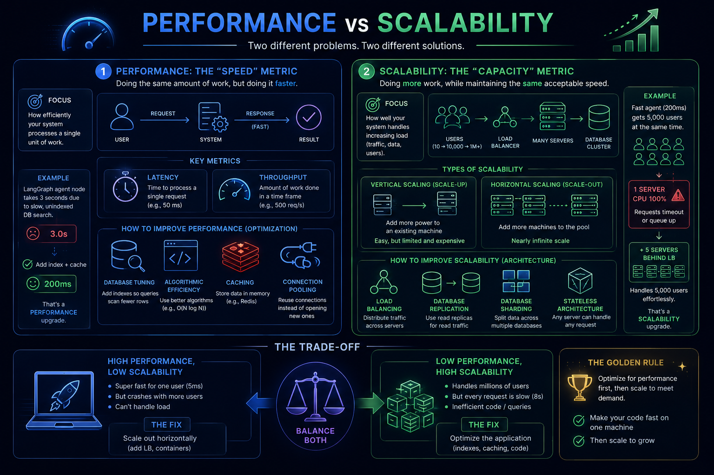

## Latency vs Throughput
Latency and throughput are two important measures of a system's performance. 

- **Latency** refers to the amount of time it takes for a system to respond to a request. 
- **Throughput** refers to the number of requests that a system can handle at the same time.

**Latency** and **Throughput** are two of the most fundamental metrics used to evaluate the health and efficiency of a system. While they are closely related, they measure two completely different dimensions of performance: **time** versus **volume**.

### 1. Latency: The Speed of a Single Request

Latency is the total time it takes for a single data packet or request to travel from its source to its destination and back. It is measured in time units, usually milliseconds (ms).

If a user clicks "Submit" on a web form and waits 2 seconds for the confirmation screen, the perceived latency is 2 seconds.

**Types of Latency in System Design:**

* **Network Latency:** The physical time it takes for electrons or light to travel over cables. A user in India querying a server in the US will inherently experience higher network latency (~200ms) than querying a server in Mumbai (~20ms) simply due to the speed of light and physical distance.
* **Disk Latency:** The time it takes for a database to read/write data to storage. Reading from RAM (cache) takes microseconds; reading from a solid-state drive (SSD) takes milliseconds.
* **Compute Latency:** The time the CPU takes to process the logic—for instance, running a complex machine learning inference or calculating a cryptographic hash.

**How to Reduce Latency:**

* **Use Content Delivery Networks (CDNs):** Cache static assets (images, JS, CSS) on edge servers physically closer to the user to eliminate network travel time.
* **In-Memory Caching:** Use tools like Redis or Memcached so your application does not have to wait for slow PostgreSQL disk reads.
* **Optimize Queries & Code:** Add database indexes, remove nested loops, or rewrite inefficient Python code to process data faster.

### 2. Throughput: The Volume of Traffic

Throughput is the maximum rate at which a system can successfully process incoming requests or transfer data over a specific period. It is measured in rates, such as Requests Per Second (RPS), Transactions Per Second (TPS), or Megabytes per second (MBps).

If your web server can successfully handle 5,000 API calls every second without dropping connections, its throughput is 5,000 RPS.

**How to Increase Throughput:**

* **Horizontal Scaling:** Add more servers behind a load balancer. If one Docker container processes 100 RPS, ten containers can process 1,000 RPS.
* **Asynchronous Processing:** Move heavy tasks to message queues (like RabbitMQ or Kafka) and background workers. The main web thread immediately returns a "Success" response (freeing it up for the next request) while the worker processes the job in the background.
* **Database Read Replicas:** Route heavy read traffic across multiple database instances so a single primary database isn't bottlenecking the data flow.

#### The Classic Analogy: The Highway

To visualize the difference, imagine a highway.

* **Latency** is the speed limit. If you drive a car at 100 km/h, it takes you 30 minutes to reach your destination.
* **Throughput** is the number of lanes. If the highway has 2 lanes, 2,000 cars can pass a specific checkpoint every hour.

If you want to improve the system:

* To **improve latency**, you raise the speed limit (e.g., to 150 km/h) so individual cars arrive faster.
* To **improve throughput**, you widen the highway to 4 lanes so more cars can travel simultaneously, even if they are still driving at 100 km/h.

#### The Relationship: Little's Law & System Congestion

Latency and throughput are distinct, but they heavily influence each other, especially under high load. This relationship is mathematically described by **Little's Law**:

$L = \lambda \times W$
*(Concurrency = Throughput $\times$ Latency)*

Where:

* $L$ is the number of requests concurrently in the system.
* $\lambda$ is the throughput (RPS).
* $W$ is the latency (time per request).

**The Congestion Problem:**
If your system has a fixed throughput capacity (e.g., it can only handle 100 concurrent requests), and traffic exceeds that capacity, the incoming requests are forced to wait in a **queue**.

Even if the *compute latency* (the actual time to process the request) is lightning fast, the *perceived latency* for the user skyrockets because their request spent 5 seconds just waiting in line before it was even processed.

Therefore: **High utilization (traffic pushing the limits of throughput) degrades latency.**
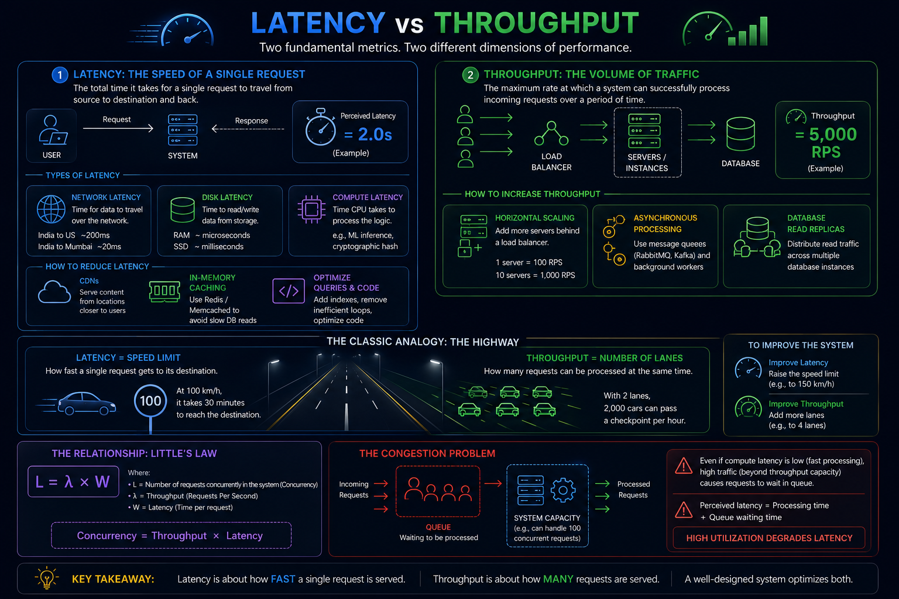

## Availability vs Consistency
- **Availability** refers to the ability of a system to provide its services to clients even in the presence of failures. This is often measured in terms of the percentage of time that the system is up and running, also known as its uptime.
- **Consistency** refers to the property that all clients see the same data at the same time. This is important for maintaining the integrity of the data stored in the system.

In distributed systems, it is often a trade-off between availability and consistency. Systems that prioritize high availability may sacrifice consistency, while systems that prioritize consistency may sacrifice availability. Different distributed systems use different approaches to balance the trade-off between availability and consistency, such as using replication or consensus algorithms.

### 1. Consistency: "Everyone sees the same truth"

Consistency means that every read request receives the most recent write. If a user updates their profile picture, and another user views their profile one millisecond later, they must see the *new* picture.

* **How it works:** When data is written to Node A, the system locks and refuses to answer read requests until that new data is successfully copied over to Node B, Node C, etc.
* **The downside:** It introduces latency (waiting for syncs) and risks downtime. If Node B crashes and cannot acknowledge the update, the whole system might refuse to process transactions to protect the integrity of the data.
* **When to use it:** Financial systems, billing platforms, or state-management for complex workflows (like LangGraph agent orchestration) where acting on stale data would cause catastrophic logical errors.

### 2. Availability: "The system is always online"

Availability means that every request receives a non-error response, regardless of the state of the individual nodes. The system guarantees it will answer you, even if the answer is slightly outdated.

* **How it works:** When data is written to Node A, it acknowledges the success immediately. It will eventually sync with Node B in the background. If you read from Node B before the sync happens, Node B just gives you whatever data it currently has.
* **The downside:** You get **Eventual Consistency**. Users might temporarily see stale data.
* **When to use it:** Social media feeds, product reviews, or metrics dashboards. If a YouTube video has 1,000,005 views but you see 1,000,000 for a few minutes, no one is harmed, but if YouTube crashes trying to keep the view count perfectly synced globally, that is a massive problem.

### The CAP Theorem

You cannot talk about Availability and Consistency without mentioning the **CAP Theorem**. It states that a distributed data store can only guarantee two out of the following three traits at the same time:

1. **C**onsistency (Every read gets the most recent write)
2. **A**vailability (Every request gets a response)
3. **P**artition Tolerance (The system continues to operate even if the network between nodes breaks or drops messages)

**Here is the reality check:** Networks *always* fail eventually (cables get cut, routers crash). Therefore, Partition Tolerance (P) is not optional; it is a forced reality of distributed systems.

Because you *must* have **P**, when a network partition happens, you have to choose between **C** and **A**:

* **CP (Consistency + Partition Tolerance):** The network between Node A and Node B breaks. To prevent them from getting out of sync, you shut down Node B. You sacrificed Availability.
* **AP (Availability + Partition Tolerance):** The network breaks. You allow Node A and Node B to keep accepting reads/writes independently. They will get out of sync, but the system stays up. You sacrificed Consistency.

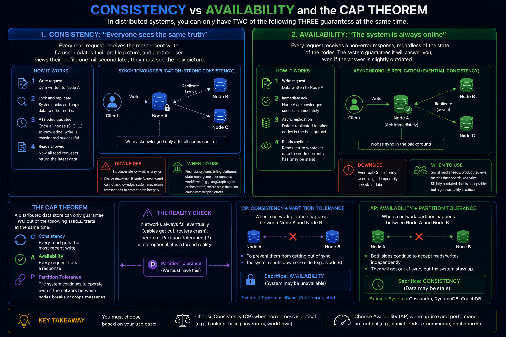

## Consistency Patterns
### 1. Strong Consistency: "Safety First"

After a write completes, **every subsequent read will return that updated value**.

* **How it works:** When you write data to Node A, the system immediately locks. Node A forces Node B and Node C to update their data as well. The write operation does not return a "Success" message to the user until *all* nodes have the new data.
* **The Trade-off:** High latency. The user has to wait for network communication between all nodes to finish before they can move on.
* **When to use it:** Financial transactions, billing systems, or any core transactional data. If you withdraw ₹10,000 from an ATM, the bank's database *must* be strongly consistent before allowing another withdrawal from a different branch.

### 2. Eventual Consistency: "Speed First, Accuracy Later"

After a write completes, reads might return stale data for a short period, but **eventually, all nodes will sync up and return the updated value**.

* **How it works:** When you write data to Node A, Node A instantly returns a "Success" message to the user. Behind the scenes, it asynchronously sends the new data to Node B and Node C.
* **The Trade-off:** Stale reads. If a user quickly reads from Node B before the background sync finishes, they will see the old data.
* **When to use it:** Social media, search engine indexes, or distributed memory stores for AI agents. If you upload a new avatar, it is fine if your friends see the old avatar for an extra 5 seconds. The system remains blazing fast and highly available.

### 3. Weak Consistency: "Best Effort"

After a write completes, **there is no guarantee that subsequent reads will ever see the updated value** unless certain conditions are met.

* **How it works:** Data is written, but the system does not try hard to ensure every node gets it. If the network drops the sync packet, the system just moves on.
* **The Trade-off:** Data loss is acceptable and expected.
* **When to use it:** VoIP calls, live multiplayer gaming, or real-time sensor telemetry. If a video frame drops during a live stream, you don't want the system to pause and wait for it; you just want to see the *next* frame.
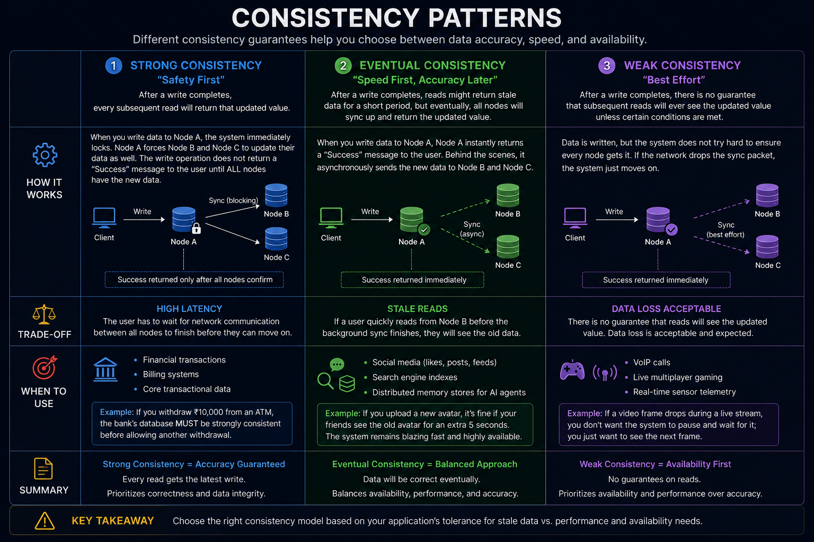

## Availability Patterns
### 1. Fail-Over: Protecting the "Compute" Layer

Fail-over applies to the servers that do the actual work—the application logic, the web servers, the API gateways. Because these servers usually don't store permanent data, routing around a failure is mostly about directing traffic.

Imagine a busy restaurant kitchen.

#### i. Active-Passive (The "Understudy" Model): 
With active-passive fail-over, heartbeats are sent between the active and the passive server on standby. If the heartbeat is interrupted, the passive server takes over the active's IP address and resumes service.

* **How it works:** You have a Head Chef (Active) cooking all the meals. You also pay a Sous-Chef (Passive) to just stand there and watch. The Sous-Chef occasionally taps the Head Chef on the shoulder (the "heartbeat"). If the Head Chef collapses, the Sous-Chef immediately takes over.
* **The Catch:** You are paying for a second chef who does absolutely nothing 99% of the time. There is also a brief delay (downtime) while the Sous-Chef figures out where the Head Chef left off.

#### ii. Active-Active (The "Co-Chef" Model):
In active-active, both servers are managing traffic, spreading the load between them.

If the servers are public-facing, the DNS would need to know about the public IPs of both servers. If the servers are internal-facing, application logic would need to know about both servers.

* **How it works:** You have two Head Chefs working side-by-side, splitting the ticket orders 50/50. If one chef collapses, the other chef simply takes on 100% of the orders.
* **The Catch:** There is zero downtime, but if that single remaining chef isn't fast enough to handle the entire restaurant's orders by themselves, they will get overwhelmed and collapse too, bringing down the whole system.

### 2. Replication: Protecting the "Data" Layer

Replication applies to your databases. This is significantly harder than Fail-Over. If a web server dies, you just send the user to another web server. But if a database dies, you risk permanently losing the user's data. You have to keep multiple copies of the data synchronized.

Imagine a system for updating a highly critical ledger book.

#### i. Master-Slave (The "Manager and Tellers" Model):
In this type of replication, one server is designated as the "master" and handles all write operations, while multiple "slave" servers handle read operations. If the master fails, one of the slaves can be promoted to take its place. This type of replication is simpler to set up and maintain compared to Master-Master replication.

* **How it works:** Only the Manager (Master) is allowed to write new entries into the official ledger. However, every time they write something, they hand photocopies to five Tellers (Slaves). If a customer just wants to *check* their balance (a read operation), they ask a Teller. If they want to *deposit* money (a write operation), they must go to the Manager.
* **The Catch:** This is fantastic for systems with massive amounts of reads (like reading a Twitter timeline) and fewer writes. But if the Manager dies, nobody can deposit money until a Teller is officially promoted to Manager.

#### ii. Master-Master (The "Two Managers" Model):
In this type of replication, multiple servers are configured as "masters," and each one can accept read and write operations. This allows for high availability and allows any of the servers to take over if one of them fails. However, this type of replication can lead to conflicts if multiple servers update the same data at the same time, so some conflict resolution mechanism is needed to handle this.

* **How it works:** You have two Managers, both with their own official ledger, both accepting deposits, and constantly yelling across the room to update each other on what they just wrote.
* **The Catch:** This provides incredible availability because either manager can handle anything. But it introduces **Conflicts**. What if Manager A and Manager B both withdraw the last $10 from the same account at the exact same millisecond before they can update each other? Resolving these "split-brain" conflicts requires very complex engineering.
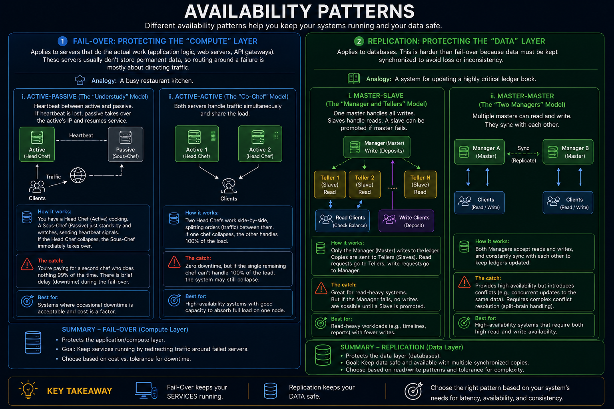

## Background Jobs
Background jobs in system design refer to tasks that are executed in the background, independently of the main execution flow of the system. These tasks are typically initiated by the system itself, rather than by a user or another external agent.

Background jobs can be used for a variety of purposes, such as:
- **Performing maintenance tasks:** such as cleaning up old data, generating reports, or backing up the database.
- **Processing large volumes of data:** such as data import, data export, or data transformation.
- **Sending notifications or messages:** such as sending email notifications or push notifications to users.
- **Performing long-running computations:** such as machine learning or data analysis.

### i. Event Driven
Event-driven invocation uses a trigger to start the background task. Examples of using event-driven triggers include:

- The UI or another job places a message in a queue. The message contains data about an action that has taken place, such as the user placing an order. The background task listens on this queue and detects the arrival of a new message. It reads the message and uses the data in it as the input to the background job. This pattern is known as asynchronous message-based communication.
- The UI or another job saves or updates a value in storage. The background task monitors the storage and detects changes. It reads the data and uses it as the input to the background job.
- The UI or another job makes a request to an endpoint, such as an HTTPS URI, or an API that is exposed as a web service. It passes the data that is required to complete the background task as part of the request. The endpoint or web service invokes the background task, which uses the data as its input.

### ii. Schedule Driven
Schedule-driven invocation uses a timer to start the background task. Examples of using schedule-driven triggers include:

- A timer that is running locally within the application or as part of the application's operating system invokes a background task on a regular basis.
- A timer that is running in a different application, such as Azure Logic Apps, sends a request to an API or web service on a regular basis. The API or web service invokes the background task.
- A separate process or application starts a timer that causes the background task to be invoked once after a specified time delay, or at a specific time.

### iii. Returning Results
Background jobs execute asynchronously in a separate process, or even in a separate location, from the UI or the process that invoked the background task. Ideally, background tasks are "fire and forget" operations, and their execution progress has no impact on the UI or the calling process. This means that the calling process does not wait for completion of the tasks. Therefore, it cannot automatically detect when the task ends.

## Domain Name System (DNS)
The **Domain Name System (DNS)** is famously known as the "phonebook of the internet." Its primary job is to translate human-readable domain names (like `roadmap.sh` or `google.com`) into machine-readable IP addresses (like `142.250.190.46`) so that computers can connect to each other.

However, in system design, DNS is much more than just a lookup table. It is the very **first point of contact** for any user trying to reach your application, and it is a globally distributed, highly available database that can make complex architectural decisions before a user even hits your servers.

### 1. The DNS Resolution Journey

When you type a URL into your browser, finding the IP address isn't a single step. It is a cascading fallback mechanism designed to reduce latency.

1. **Browser & OS Cache:** The browser checks its own memory. If it isn't there, it checks your computer's operating system cache. If you've visited the site recently, the lookup ends here in milliseconds.
2. **Recursive Resolver:** If the IP isn't cached locally, your computer asks a resolver (usually provided by your Internet Service Provider, or a public one like Google's `8.8.8.8`). The resolver checks its massive cache.
3. **Root Name Server:** If the resolver doesn't know, it queries one of the 13 logical Root Servers globally. The Root server says, *"I don't know the IP, but I know who handles `.com` domains."*
4. **TLD (Top-Level Domain) Server:** The resolver then asks the `.com` server. The TLD server says, *"I don't know the IP, but I know the specific Authoritative Server for `roadmap.sh`."*
5. **Authoritative Name Server:** The resolver finally reaches the server where the domain's owner actually configured their DNS records (e.g., AWS Route53, Cloudflare). This server provides the exact IP address, which travels all the way back to your browser.

*System Design Takeaway:* Because this 5-step process takes time (latency), DNS relies heavily on **caching** at every single level with a **TTL (Time to Live)**. If you change your server's IP address, it can take anywhere from 5 minutes to 24 hours for the new IP to propagate globally because everyone is holding onto the cached old IP.
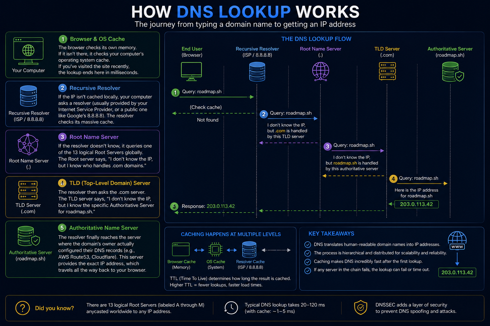
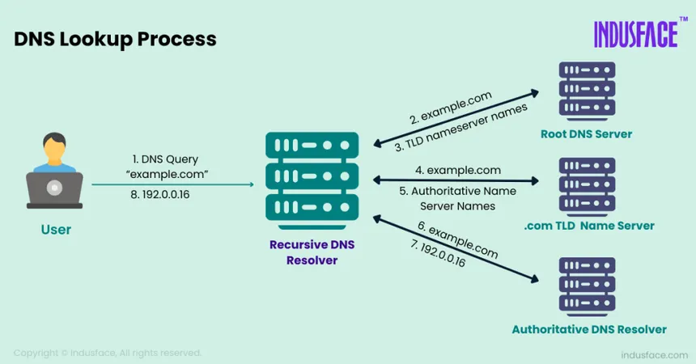

### 2. DNS as a Load Balancer (Advanced Routing)

In modern system design, you don't just point a domain to a single IP address. You use the Authoritative Name Server to intelligently route traffic *before* it even hits your application load balancers.

Here are the advanced DNS routing patterns:

* **Simple Routing:** One domain points to one IP. (Fine for a small blog).
* **Weighted Routing:** You point your domain to two different server IPs. You tell DNS to send 90% of requests to Server A, and 10% to Server B. This is perfect for safely testing a new version of your software (Canary Deployment) with a small group of real users.
* **Latency Routing:** DNS checks where the user is, checks the latency to your various server regions, and returns the IP of the server that will respond the fastest.
* **Geo-Location Routing:** DNS routes traffic based on the user's physical location. A user querying from Bengaluru gets the IP for your `ap-south-1` (Mumbai) cluster, while a user in New York gets the IP for your `us-east-1` (Virginia) cluster. This is crucial for both performance and data compliance laws (like GDPR).
* **Failover Routing:** DNS constantly pings your Primary Server. If the Primary Server stops responding, DNS automatically updates itself to start returning the IP of your Backup (Passive) Server.

## Content Delivery Networks
A **Content Delivery Network (CDN)** is one of the easiest and most cost-effective ways to massively improve both the **performance** (latency) and **scalability** (throughput) of a system.

If the Domain Name System (DNS) is the internet's phonebook, a CDN is the internet's **global supply chain**.

Here is a simple analogy: Imagine you buy a pair of shoes from Amazon. If Amazon only had one warehouse in Seattle, every single customer in the world would have to wait weeks for their shoes. Instead, Amazon builds local warehouses near major cities, stocks them with the most popular shoes, and delivers them the next day.

A CDN does the exact same thing, but for digital assets (Images, Videos, HTML, CSS, JavaScript).

### How a CDN Works

Instead of forcing every user to download your website's logo from your single **Origin Server** in New York, a CDN provider (like Cloudflare, AWS CloudFront, or Akamai) gives you access to a network of thousands of **Edge Servers** distributed globally.

When a user in London visits your site, the DNS routes them to the London Edge Server. The Edge Server hands them the logo in 10 milliseconds. Your Origin Server in New York doesn't even know the interaction happened.

**Why this is crucial for System Design:**

1. **Lowers Latency:** Physics is undefeated. Data traveling from London to New York takes time (~90ms). Data traveling from London to London takes ~5ms.
2. **Protects the Origin:** If your website goes viral and 1 million people visit it, your Origin Server would normally crash. With a CDN, the Edge Servers absorb 99% of that traffic, keeping your Origin Server safe and online.

### Push CDNs vs. Pull CDNs

In the roadmap, you will see CDNs divided into two primary strategies. This refers to how the data actually gets from your Origin Server onto the Edge Servers.

#### 1. Push CDNs

You, the developer, manually upload your files directly to the CDN.

* **How it works:** Whenever you update your website, your deployment pipeline "pushes" the new images and code to the CDN. The CDN then proactively copies those files to all of its global Edge Servers.
* **The Pros:** Content is instantly available everywhere. There is no waiting for the first user to trigger a download.
* **The Cons:** You pay to store *everything* on the CDN, even files that nobody ever looks at.
* **When to use it:** Small websites with a limited amount of static content, or systems where content rarely changes but must be immediately fast when it does.

#### 2. Pull CDNs (Most Common)

The CDN is lazy. It does absolutely nothing until a user asks for a file.

* **How it works:** A user in Tokyo requests `image.png`. The Tokyo Edge Server says, *"I don't have that."* (This is a **Cache Miss**). The Tokyo Edge Server quickly pulls the image from your Origin Server in New York, serves it to the user, and *saves a copy*. The next 10,000 users in Tokyo who ask for `image.png` get the saved copy instantly. (This is a **Cache Hit**).
* **The Pros:** You only use storage space on the CDN for files that people actually want to see. It is highly cost-effective.
* **The Cons:** The very first user in a new region will experience high latency because they have to wait for the Edge Server to pull from the Origin.
* **When to use it:** Large applications with millions of dynamic assets (like YouTube thumbnails, Twitter images, or e-commerce product photos).

## Load Balancer (LB)
If you want to scale horizontally (adding more servers to handle more throughput), you absolutely must have a **Load Balancer (LB)**.

Think of a load balancer as the ultimate traffic cop for your system. When 100,000 users try to access your application, they don't connect to your servers directly. They connect to the load balancer, which then dictates exactly which backend server will process each user's request.

This solves two massive system design problems:

1. **Scalability:** It distributes the workload so no single server gets overwhelmed.
2. **Availability:** It acts as a health monitor. If Server B crashes, the load balancer instantly stops sending traffic to it, routing everyone to Servers A and C instead.

Here is how load balancers are categorized and configured.

---

### 1. Load Balancer vs. Reverse Proxy

These terms are often used interchangeably because modern software (like Nginx, HAProxy, or Traefik) usually does both at the same time. However, their primary purposes are different:

* **Load Balancer:** Its primary job is distributing traffic across a pool of *identical* servers to increase capacity and reliability.
* **Reverse Proxy:** Its primary job is shielding your backend servers from the internet. It sits in front of your servers and handles tasks like SSL termination (decrypting HTTPS so your servers don't have to), caching, and routing traffic to *different* services based on the URL (e.g., sending `/api` requests to a Python backend, and `/blog` requests to a WordPress backend).

* Deploying a load balancer is useful when you have multiple servers. Often, load balancers route traffic to a set of servers serving the same function.
* Reverse proxies can be useful even with just one web server or application server.
* Solutions such as NGINX and HAProxy can support both layer 7 reverse proxying and load balancing.

### 2. Load Balancing Algorithms

When a request arrives, how does the load balancer decide who gets it? You have to configure an algorithm based on your application's needs.
- A load balancer is a software or hardware device that keeps any one server from becoming overloaded. A load balancing algorithm is the logic that a load balancer uses to distribute network traffic between servers (an algorithm is a set of predefined rules).
- There are two primary approaches to load balancing. Dynamic load balancing uses algorithms that take into account the current state of each server and distribute traffic accordingly. 
- Static load balancing distributes traffic without making these adjustments. Some static algorithms send an equal amount of traffic to each server in a group, either in a specified order or at random.

#### Algorithms:
* **Round Robin:** The simplest method. It distributes requests sequentially: Server 1, then Server 2, then Server 3, then back to Server 1.
* *Best for:* Systems where all servers are exactly the same size and all requests take roughly the same amount of time to process.

* **Least Connections:** The LB checks which server currently has the fewest active requests being processed and sends the new request there.
* *Best for:* Applications where some requests take much longer than others (e.g., one user asks for a simple text file, another asks for a heavy database export). It prevents a server from getting bogged down with too many heavy tasks.

* **IP Hash (Sticky Sessions):** The LB calculates a mathematical hash based on the user's IP address. This guarantees that User A will *always* be routed to Server 1.
* *Best for:* Legacy applications that store user login sessions in the server's local RAM instead of a centralized database like Redis. (Note: In modern system design, we try to avoid this and build "stateless" applications).

### 3. Layer 4 vs. Layer 7 Load Balancing

In system design interviews and cloud architecture, you will frequently be asked at which OSI layer your load balancer operates.

#### i. Layer 4 (Transport Layer):
* **How it works:** It routes traffic based *only* on the source,destination IP address and the TCP/UDP port. It doesn't look at the actual content of the request.
* **Pros:** Blazing fast. Because it isn't decrypting or reading the data, it uses very little CPU and can handle millions of requests per second.
* **Example:** AWS Network Load Balancer (NLB). Perfect for multiplayer gaming or raw database connections.

#### ii. Layer 7 (Application Layer):
* **How it works:** It looks *inside* the HTTP/HTTPS packet. It can read the URL path, the cookies, and the headers. Layer 7 load balancers terminate network traffic, reads the message, makes a load-balancing decision, then opens a connection to the selected server.
* **Pros:** Extremely smart routing. It can send `/video` traffic to high-bandwidth servers and `/chat` traffic to high-compute servers.
* **Example:** AWS Application Load Balancer (ALB). Slower than L4, but essential for modern microservice architectures.
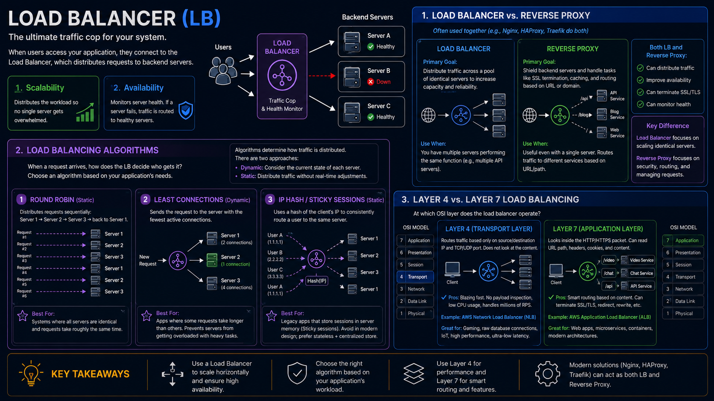

## Application Layer

When you separate the web layer (the frontend handling HTTP requests) from the application layer (the backend processing business logic), you open the door to **Microservices**. But once you break your application apart, you immediately encounter a massive networking problem, which is solved by **Service Discovery**.

Here is how these two concepts fit together in modern system design.

### 1. Microservices (The "What")

In a traditional monolithic architecture, your entire application—let's say an e-commerce platform with User Profiles, Product Catalog, and Billing—is bundled into one giant codebase and runs on a single server instance.

In a **Microservices** architecture, you split that monolith into small, autonomous applications based on the Single Responsibility Principle.

* **How it works:** You have a `User Service`, a `Catalog Service`, and a `Billing Service`. Each service is developed independently, deployed in its own Docker container, and usually has its own dedicated database (like an isolated PostgreSQL instance) so they don't step on each other's toes.
* **The Advantage (Agility & Scaling):** If your website gets hit by a massive wave of traffic on Black Friday, mostly from people browsing items, you don't need to duplicate the entire heavy application. You just spin up 10 extra containers of the `Catalog Service`. The `Billing Service` can stay exactly as it is.
* **The Disadvantage (Complexity):** You now have a distributed system. Instead of one function simply calling another function within the same code, these services have to communicate over the network via APIs or RPC calls. Networks fail, latency increases, and monitoring becomes a headache.

### 2. Service Discovery (The "How")

Once you move to microservices, you face a critical infrastructure problem: **Dynamic IP Addresses**.

If your `User Service` needs to talk to your `Billing Service`, it needs an IP address. In the old days, you would hardcode `192.168.1.50` into a configuration file. But in a microservices world, containers are constantly being spun up to handle load, and destroyed when traffic drops. Every time a container spins up, it gets a random, unpredictable IP address.

**Service Discovery** is the internal phonebook that solves this. It relies on a central tool called a **Service Registry** (like Consul, Eureka, or Kubernetes etcd).

Here is the exact flow:

1. **Registration:** When a new `Billing Service` container spins up, the very first thing it does is ping the Service Registry and say: *"Hi, I am a Billing Service, and my current IP is 10.4.5.99."*
2. **Heartbeats:** The `Billing Service` constantly sends "heartbeats" (pings) to the Registry every few seconds to prove it is still alive. If it crashes, the Registry removes its IP from the list.
3. **Discovery:** When the `User Service` wants to process a payment, it doesn't try to guess an IP. It asks the Service Registry: *"Give me the IP of an available Billing Service."* 
4. **Routing:** The Registry returns a healthy IP, and the `User Service` makes its network call.

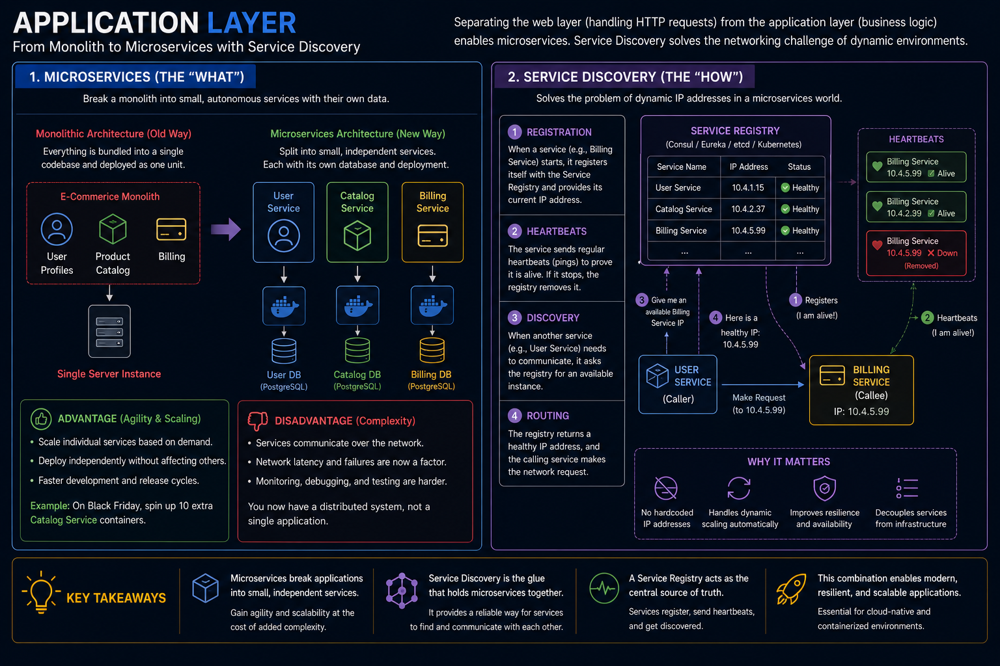

## Databases
In system design, everything we have discussed so far—Load Balancers, Microservices, CDNs—is relatively easy to scale because they are **stateless**. If a web server dies, you spin up a new one. It doesn't need to remember anything.

The **Database** is the hardest part of system design because it is **stateful**. It holds the actual truth of your application (user accounts, billing data, inventory). You cannot just arbitrarily destroy and recreate databases without risking catastrophic data loss.

Picking the right database for a system is an important decision, as it can have a significant impact on the performance, scalability, and overall success of the system. Some of the key reasons why it's important to pick the right database include:

- **Performance:** Different databases have different performance characteristics, and choosing the wrong one can lead to poor performance and slow response times.
- **Scalability:** As the system grows and the volume of data increases, the database needs to be able to scale accordingly. Some databases are better suited for handling large amounts of data than others.
- **Data Modeling:** Different databases have different data modeling capabilities and choosing the right one can help to keep the data consistent and organized.
- **Data Integrity:** Different databases have different capabilities for maintaining data integrity, such as enforcing constraints, and can have different levels of data security.
- **Support and maintenance:** Some databases have more active communities and better documentation, making it easier to find help and resources.

### SQL vs noSQL
SQL databases, such as MySQL and PostgreSQL, are best suited for structured, relational data and use a fixed schema. They provide robust ACID (Atomicity, Consistency, Isolation, Durability) transactions and support complex queries and joins.

NoSQL databases, such as MongoDB and Cassandra, are best suited for unstructured, non-relational data and use a flexible schema. They provide high scalability and performance for large amounts of data and are often used in big data and real-time web applications.

#### 1. SQL (Relational Databases)

Relational databases organize data into rigid, two-dimensional tables (relations) containing rows (tuples) and columns (attributes) (PostgreSQL, MySQL, Oracle). This model relies heavily on relational algebra.

##### The Core Pillars:

* **Strict Schema:** The structure of the data must be declared before any data can be written. Every row in a table must have the exact same columns, even if many fields contain `NULL` values. Modifying this structure later requires an expensive `ALTER TABLE` statement, which can lock the table in production.
* **Normalization:** Data is decomposed into small, distinct tables to eliminate redundancy and preserve data integrity (Normal Forms like 1NF, 2NF, 3NF). For example, rather than repeating a customer's address on every order ticket, the address is stored once in a `Customers` table, and the `Orders` table points to it using a **Foreign Key**.
* **ACID Compliance:** SQL databases use a write-ahead log (WAL) and strict locking mechanisms to guarantee execution integrity:
  * *Atomicity:* All operations within a transaction succeed completely, or the entire transaction is aborted and rolled back.
  * *Consistency:* A transaction can only transition the database from one valid state to another, maintaining all schema constraints.
  * *Isolation:* Concurrent execution of transactions leaves the database in the same state as if they were executed sequentially.
  * *Durability:* Once a transaction is committed, it remains saved even during a total power failure or system crash.

##### How It Processes Queries (The Cost of Joins):

When you run a `SELECT` query that connects multiple tables via a `JOIN`, the database engine must execute a relational join algorithm (such as a *Nested Loop Join*, *Hash Join*, or *Sort-Merge Join*). If the columns used to join the tables are not properly indexed (using B-Trees), the engine must scan the entire disk area of both tables, causing CPU and disk I/O bottlenecks.

#### 2. NoSQL (Non-Relational Databases)

NoSQL databases abandon the rigid tabular structure and the relational model. Instead of enforcing mathematical relations at the disk layer, they focus on optimizing specific access patterns and achieving rapid horizontal scale.

##### The Four Main Sub-Types:

1. **Document Stores (e.g., MongoDB, Couchbase):** Data is stored as semi-structured documents, typically in JSON or BSON formats. Related information is deliberately **denormalized** and embedded within a single document. Instead of joining a `Users` table to an `Addresses` table, the addresses live directly inside the user's document as an array.
2. **Key-Value Stores (e.g., Redis, Memcached):** The simplest data model imaginable. The database acts as a massive hash table where arbitrary values (strings, sets, binary objects) are looked up using a unique key. These are heavily optimized for memory-first reads, achieving sub-millisecond latencies.
3. **Wide-Column / Column-Family Stores (e.g., Cassandra, ScyllaDB):** Instead of storing rows sequentially on disk, data is stored in columns. Rows are dynamic and can contain completely different sets of columns. This architecture is optimized for high-volume writes and sorting massive amounts of time-series or logging data across distributed clusters.
4. **Graph Databases (e.g., Neo4j, Amazon Neptune):** Data is represented as **Nodes** (entities) and **Edges** (relationships), both of which can store key-value properties. Instead of computing expensive index lookups or multi-table joins to find connections, graph databases use *index-free adjacency*, meaning every node maintains direct physical pointers to its neighboring nodes on disk.

##### The BASE Philosophy:

Unlike the strict ACID rules of SQL, many distributed NoSQL engines operate under the **BASE** model to prioritize availability and scale:

* **B**asically **A**vailable: The system guarantees a response to every request, but it might return stale data or an error state if a node is offline.
* **S**oft State: The data can change over time without explicit user interaction because of background replication loops.
* **E**ventual Consistency: The system will eventually become consistent across all distributed nodes, but it does not guarantee immediate consistency on subsequent reads.

#### Key Technical Comparison

| Architectural Trait          | SQL (Relational)                                                                                                                                                        | NoSQL (Non-Relational)                                                                                                                                       |
| ---------------------------- | ----------------------------------------------------------------------------------------------------------------------------------------------------------------------- | ------------------------------------------------------------------------------------------------------------------------------------------------------------ |
| **Data Storage**             | Tabular rows and columns; highly normalized.                                                                                                                            | Flexible (Documents, Key-Value pairs, Wide-Columns, Graphs); highly denormalized.                                                                            |
| **Primary Scaling Strategy** | **Vertical Scaling** (Scale-Up). Relational integrity requires a shared compute context, meaning you need a bigger machine with faster CPUs and larger RAM allocations. | **Horizontal Scaling** (Scale-Out). Data is easily distributed across standard, cheap servers by automatically partitioning (sharding) independent datasets. |
| **Transactions & Locks**     | Strong ACID guarantees. Uses pessimistic or optimistic locking mechanisms to protect multi-row consistency.                                                             | Usually BASE or single-document atomic operations. Distributed multi-document transactions are either unsupported or carry high network latency costs.       |
| **Query Mechanism**          | Declarative structured language (SQL) parsed and optimized by a centralized engine.                                                                                     | Object-level APIs, key lookups, or custom graph/document traversal languages (e.g., MQL, Cypher).                                                            |

#### Architectural Selection Framework

* **Choose SQL when:**
  * The data schema is predictable, highly structured, and unlikely to change radically over time.
  * Data relationships are deeply interconnected and require consistent integrity guarantees (e.g., ledger accounting, billing dependencies, profile permissions).
  * The business cannot accept temporary stale data under any circumstances (Strong Consistency is mandatory).

* **Choose NoSQL when:**
  * The application processes unstructured or polymorphic data where the fields vary unpredictably from record to record.
  * The target write volume is immense (thousands of transactions per second), requiring the storage system to scale out horizontally across multiple availability zones.
  * Low latency and high availability are significantly more important than perfect data consistency (e.g., real-time user clickstreams, IoT telemetry data, chat histories, or catalog browsing).

## Database Architecture
When scaling a stateful application, your database eventually becomes the ultimate bottleneck. When a single database instance cannot handle the query volume, storage limits, or write throughput, engineers rely on five advanced architectural and procedural strategies to scale the data layer: **Replication**, **Sharding**, **Federation**, **Denormalization**, and **SQL Tuning**.

### 1. Replication: Scaling Reads & Guaranteeing Fault Tolerance

Replication is the process of keeping copies of the exact same data across multiple physical machines (nodes) over a network.

#### How it works:

The system is divided into roles. In a **Leader-Follower (Master-Slave)** setup, all data modifications (Writes, Updates, Deletes) are directed to a single primary node called the **Leader**. The Leader records the change in its write-ahead log (WAL) and copies the log over the network to one or more **Followers**. The Followers are strictly read-only and serve all incoming read traffic.

#### Key Engineering Decisions:

* **Synchronous vs. Asynchronous:** 
  * *Synchronous:* The Leader waits for all Followers to confirm they have written the data before telling the application "Success." This guarantees strong consistency but introduces severe write latency.
  * *Asynchronous:* The Leader confirms the write instantly and syncs with followers in the background. This is highly performant but introduces **Replication Lag**, where a client might read stale data from a follower that hasn't caught up yet.
* **Failover Mechanics:** If the Leader dies, the remaining nodes hold an automated election (using consensus protocols like Raft) to promote the healthiest Follower to become the new Leader.

### 2. Sharding: Scaling Writes via Horizontal Partitioning

Replication solves the read traffic problem, but it does not help if your database is overwhelmed by *writes*, or if your total dataset size is too large to fit on a single hard drive. Sharding solves this by breaking a single table down into smaller chunks and spreading them across independent database instances.

#### How it works:

Instead of storing all 100 million user rows on one machine, you divide the rows across multiple database servers (shards). A centralized **Routing Layer** examines a specific column in the data—known as the **Shard Key**—to determine which machine owns that specific row.

#### Core Sharding Strategies:

* **Range-Based Sharding:** Splitting data by ranges of a value (e.g., IDs 1–1M go to Shard 1, 1M–2M go to Shard 2).
* *The Catch:* Can cause massive **hotspots** if newer data is accessed far more frequently than old data.

* **Hash-Based Sharding:** Passing the Shard Key through a mathematical hash function (e.g., `Hash(UserID) % Number of Shards`). This ensures a completely uniform distribution of data across all shards.
* **Directory-Based Sharding:** Maintaining an external lookup table that maps IDs to physical shard locations.

#### The Massive Trade-off:

Sharding introduces immense complexity. Cross-shard `JOIN` operations become mathematically expensive or completely unsupported. Distributed transactions require complex two-phase commit (2PC) protocols, which slow down performance.

### 3. Federation: Functional Partitioning

Federation (also known as functional partitioning) scales a database by splitting tables apart based on business domains or functional boundaries.

#### How it works:

Instead of having one massive monolithic database instance containing all your tables, you create completely separate database instances for different business units. For example, all tables related to user identity (`users`, `permissions`) move to an **Auth Database**. All tables related to inventory (`products`, `stock`) move to a **Catalog Database**.

#### Comparison with Sharding:

* **Sharding** splits a *single table's rows* across multiple machines (Vertical slices of data).
* **Federation** splits *different tables* across multiple machines based on logic (Horizontal separation of concerns).

#### The Technical Challenge:

Federation fits perfectly with microservice architectures. However, like sharding, it destroys your ability to perform native SQL `JOIN` operations across domains. If you need to generate a report showing a user's name alongside their ordered products, the application layer must execute two independent queries across two separate networks and manually stitch the datasets together in memory.

### 4. Denormalization: Trading Write Performance for Read Speed

In traditional relational database design, developers follow **Normalization rules (1NF to 3NF)** to ensure that every piece of data is stored in exactly one place. This eliminates data redundancy and prevents data anomalies. However, highly normalized databases require complex, multi-table `JOIN` operations at read time.

**Denormalization** is the deliberate decision to break normalization rules and inject redundant copies of data into a schema to optimize read performance.

#### How it works:

Imagine an e-commerce platform. To show an order history screen, a normalized database must `JOIN` the `Orders` table, the `Users` table, and the `Products` table. Under heavy traffic, computing this join millions of times crushes the CPU.

When denormalized, you store the user's name and the product's title directly *inside* the `Orders` row at the moment of purchase.

#### The Cost of Denormalization:

* **Increased Storage Space:** Data is duplicated across thousands of rows.
* **Write Penalty:** When data changes, the application must execute multiple writes to update every redundant copy across the system.
* **Data Inconsistency Risks:** If a user changes their name, older order records will still hold their old name unless a heavy background reconciliation job is run to sync the records.

### 5. SQL Tuning: Extracting Maximum Efficiency from Raw Hardware

Before implementing expensive architectural changes like sharding or federation, engineers look inward at **SQL Tuning**—optimizing how the database engine compiles, evaluates, and executes queries.

#### The Primary Focus Areas:

* **Index Optimization:** The database engine scans the entire disk sequentially (Full Table Scan) unless a proper index is defined. Creating a **B-Tree Index** transforms an $O(N)$ lookup into a blazing-fast $O(\log N)$ logarithmic lookup.
* **Execution Plan Analysis:** Using commands like `EXPLAIN ANALYZE` allows developers to inspect the database's internal execution plan. It reveals exactly where the engine is spending its time (e.g., identifying a slow *Nested Loop Join* that should be optimized into a *Hash Join*).
* **Avoiding Anti-Patterns:**
* Replacing `SELECT *` with explicit column names to reduce network payload and disk I/O.
* Utilizing **Covering Indexes**, where the index itself contains all the columns requested by the query, allowing the engine to completely bypass reading the primary table layout on disk.
* Replacing heavy wildcards (like `LIKE '%text%'`) which invalidate B-Tree indexes with specialized Full-Text Search (FTS) indexes or inverted indexes.

## Caching
Caching is the absolute cheat code for system performance. While adding more servers or sharding databases can be expensive and complex, introducing a well-designed cache layer can immediately drop read latencies from hundreds of milliseconds to microseconds, while completely shielding your core databases from heavy read traffic.

To master caching, you must understand both **where** the data is stored (Topologies) and **how** the data moves between the application, the cache, and the database (Strategies).

---

### 1. Caching Strategies (The Data Flow Patterns)

These strategies dictate how your application interacts with the cache layer during Read and Write operations. Choosing the wrong strategy can lead to data corruption, stale data, or extreme memory bloat.

#### i. Cache Aside (Lazy Loading)

This is the most widely used caching pattern. The application is entirely responsible for interacting with both the cache and the database.

* **Read Path:** The application checks the cache first. If it is a **Cache Hit**, the data is returned immediately. If it is a **Cache Miss**, the application queries the database, writes the retrieved data into the cache for future requests, and returns it to the user.
* **Write Path:** When data changes, the application writes directly to the database and then explicitly **invalidates (deletes)** the cache entry to avoid serving stale data.
* **Trade-off:** Fast reads after the initial miss. However, if the cache crashes, the database is suddenly exposed to a massive influx of traffic (Cache Stampede).
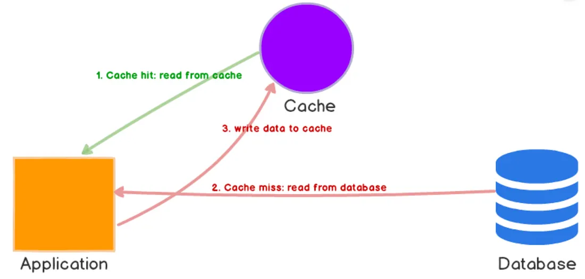

#### Read-Through / Write-Through

In these patterns, the application treats the cache as if it were the main data store. The application never talks to the database directly; the cache layer handles the backend data syncing.

* **Read-Through:** Works exactly like Cache Aside, but the cache layer itself automatically fetches data from the database on a miss, populates its own memory, and hands it back to the application.
* **Write-Through:** When the application writes data, it writes it to the cache. The cache synchronously writes that same data to the database.
* **Trade-off:** Data is guaranteed to never be stale. However, write latency is high because every write must wait for both the cache and the disk-based database to complete.
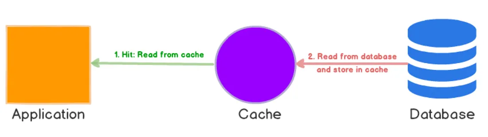
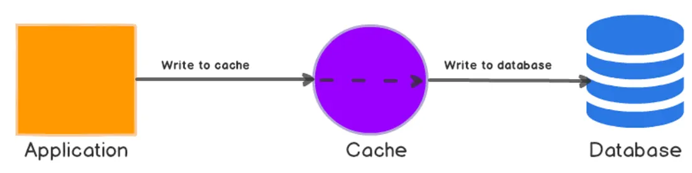

#### Write-Behind (Write-Back)

An advanced, highly performant write strategy optimized for write-heavy applications.

* **How it works:** The application writes data to the cache, which acknowledges success immediately (sub-millisecond write times). The cache then batches these writes and asynchronously flushes them to the database in the background.
* **Trade-off:** Extreme write throughput. However, if the cache server experiences a sudden hardware crash or power loss before flushing its memory to the database, that data is permanently lost.
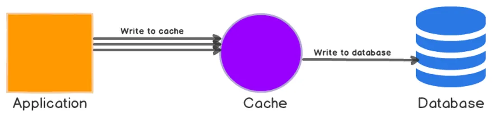

#### Refresh Ahead

The cache proactively reloads hot data before it actually expires based on historical access patterns. If an item has a Time-To-Live (TTL) of 60 seconds, and it is accessed heavily at second 55, the cache automatically refreshes the item from the database in the background.
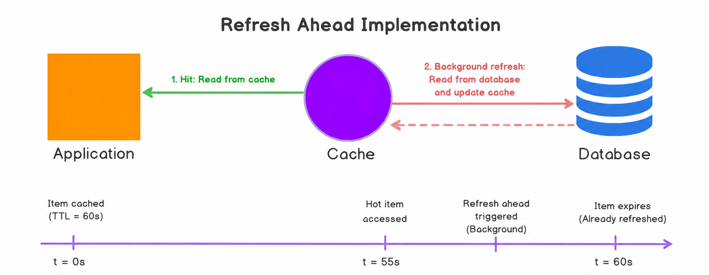

### 2. Caching Topologies (Where the Cache Lives)

An enterprise application does not use just one cache; it deploys caches at every single tier of the request lifecycle to stop data from traveling deeper into the architecture than necessary.

1. **Client Caching (Browser/Mobile):** Storing static assets, page layouts, or localized data directly on the user's device using HTTP headers (`Cache-Control`, `ETag`). It completely eliminates the network trip to your servers.
2. **CDN Caching:** Caching full edge responses or media files geographically close to the user (as discussed previously).
3. **Web Server / Reverse Proxy Caching:** Tools like Nginx or Varnish intercept incoming HTTP requests at your server boundary and return fully rendered HTML pages or API responses without waking up your application runtime.
4. **Application Caching (In-Memory Stores):** Highly optimized, distributed memory stores like Redis or Memcached sit alongside your application servers. This is where you cache complex object configurations, active user sessions, or heavily processed data structures.
5. **Database Caching:** Relational engines (like PostgreSQL) utilize internal memory buffers (e.g., `shared_buffers` or buffer pools) to keep recently accessed table pages and indexes in RAM, preventing slow disk-read operations.

## Asynchronism
In system design, **Asynchronism** (or asynchronous processing) is the ultimate tool for protecting your application from heavy, time-consuming tasks.

If caching is about fetching data faster, asynchronism is about **delaying work** so the user doesn't have to wait for it to finish.

Here is the easiest way to understand the difference:

* **Synchronous (In-line):** You go to a fast-food counter, order a burger, and stand there staring at the cashier until the burger is cooked and handed to you. You cannot do anything else.
* **Asynchronous (Background):** You go to a restaurant, order your food, and the waiter gives you a buzzer. You go sit down, talk to your friends, and drink your water. When the food is ready, the buzzer goes off. Your time was not blocked.

Here is how we translate that into software architecture.

### 1. The Problem: Synchronous Bottlenecks

Imagine you are building a social media app. A user clicks "Sign Up."
If the architecture is synchronous, the Web Server has to:

1. Save the user to the database (10ms)
2. Generate a welcome PDF (1500ms)
3. Send a Welcome Email via a 3rd party API (2000ms)

The user is staring at a spinning loading wheel for nearly **4 seconds** just to create an account. Worse, if the 3rd party Email API is down, the whole sign-up process crashes, and the user gets an error.

### 2. The Solution: Task Queues and Workers

To make this asynchronous, we introduce two new components to the architecture: a **Message Queue** (like RabbitMQ, Apache Kafka, or AWS SQS) and **Background Workers** (like Celery for Python).

Here is the new flow:

1. The user clicks "Sign Up."
2. The Web Server saves the user to the database (10ms).
3. The Web Server creates a simple text message: *"Send welcome email to user 123"*, and drops it into the **Message Queue** (5ms).
4. The Web Server immediately replies to the user: *"Account created successfully!"* **(Total user wait time: 15ms).**
5. Meanwhile, a **Background Worker** wakes up, sees the message in the queue, generates the PDF, and sends the email. If the Email API is down, the Worker just leaves the message in the queue and tries again in 5 minutes. The user never notices.

### 3. Common Patterns of Asynchronism

As the roadmap mentions, this pattern takes two primary forms:

* **Event-Driven (Task/Message Queues):** Reacting to user actions immediately, but processing the heavy lifting in the background.
* *Examples:* Video rendering (YouTube), generating massive CSV exports, sending push notifications, processing payments.

* **Schedule-Driven (Cron Jobs / Batch Processing):** Running heavy tasks automatically at specific times to prepare data *before* the user even asks for it.
* *Examples:* At 2:00 AM every night, a worker aggregates all the sales data from the day and generates a dashboard report so that when the CEO logs in at 8:00 AM, the dashboard loads instantly instead of calculating millions of rows on the fly.

### 4. Advanced Concepts to Watch Out For

When you decouple your system like this, you introduce new engineering challenges:

* **Back Pressure:** What happens if users are uploading videos faster than your workers can process them? The queue fills up. If the queue gets too full, it will crash. Back pressure is a system design mechanism where the queue signals the web server to say, *"Slow down, stop accepting uploads, I'm full!"*
* **Idempotency:** Networks fail. Sometimes a worker processes a payment, but crashes before it can delete the message from the queue. Another worker picks up the same message and processes the payment *again*. An idempotent operation guarantees that no matter how many times a worker reads the exact same message, the user is only charged once.

## Idempotence
- Simply put, we can perform an idempotent operation multiple times without changing the result.
- Furthermore, the operation must not cause any side effects after the first successful execution.

Let’s look at two simple examples.

### Absolute Value

A function that returns the absolute value is idempotent; no matter how often we apply it to the same number, it always returns the same result.

Let’s consider the function:

a(x) = |x|

Then the following is true:

a(a(x)) = a(x)

#### i. Example:

a(-42) = a(a(-42)) = 42

In contrast, a function that flips the sign of a number is not idempotent:

b(x) = -x

Then:

b(b(x)) \ne b(x)

#### ii. Example:

b(-42) = 42 \ne a(a(-42))

## Why Idempotence?
In software engineering, an **idempotent operation** is an action that can be executed multiple times without changing the result beyond the initial application.

No matter how many times you repeat the exact same request, the system's state remains exactly as it was after the very first successful request.

### The Real-World Analogy

* **Idempotent (The Elevator Button):** You are waiting for an elevator. You press the "Down" button once. The button lights up, and the system registers your request. If you get impatient and mash the button 10 more times, nothing changes. You don't summon 10 elevators, and the elevator doesn't arrive faster. The end result is exactly the same as if you had pressed it once.
* **Non-Idempotent (The ATM Withdrawal):** You go to an ATM and request a $50 withdrawal. The machine gives you $50, and your bank balance decreases by $50. If you repeat that exact same action a second time, you get another $50, and your balance decreases again. The state of the system changes every single time the action is performed.

### Idempotency in REST APIs

In web architecture, HTTP methods are strictly categorized by whether they are inherently idempotent or not.

#### 1. Inherently Idempotent Methods

When a client sends these requests, they should feel confident that retrying them during a network failure won't accidentally corrupt data.

* **`GET` (Read):** Fetching a user's profile 100 times doesn't change the profile.
* **`PUT` (Replace/Update):** If you send `PUT /payee/123` with the payload `{ "name": "John" }`, doing it once updates the name to John. Doing it 50 times just keeps overwriting the name with "John". The end state is the same.
* **`DELETE` (Remove):** If you send `DELETE /payee/123`, the record is removed. If you send it again, the record is still gone (the server might return a `404 Not Found` the second time, but the *state of the database* hasn't changed further).

#### 2. Non-Idempotent Methods

These methods change the state of the system every time they are called.

* **`POST` (Create):** If you send `POST /payees` with `{ "name": "John" }`, the database creates a new row with ID 1. If you send it again, it creates a *second* row with ID 2.
* **`PATCH` (Partial Update):** Often non-idempotent depending on the implementation. If your payload is `{ "increment_balance_by": 10 }`, sending it 5 times adds 50 to the balance.

## Communication
In system design, once you have split your application into microservices or distributed your databases, you face a new fundamental problem: **How do these pieces talk to each other?**

If a system cannot communicate efficiently, the entire architecture collapses under network latency. To understand communication, we have to look at it in two layers: the **Network Protocols** (how the data physically travels over the wires) and the **Architectural Styles** (how the applications actually format and understand the conversation).

Here is the system design breakdown of how systems talk.

### 1. Network Protocols (The Delivery Mechanisms)

At the lower levels of the network stack, you have to choose how your data packets are transported. This is a strict trade-off between **Reliability** and **Speed**.

#### i. TCP (Transmission Control Protocol): The Reliable Courier
* **How it works:** Before sending data, TCP establishes a connection using a "Three-Way Handshake" (Hello -> Hi, I hear you -> Great, sending data). It numbers every single packet of data. If packet #4 gets lost, the receiver asks for it again, and TCP resends it.
* **The Trade-off:** 100% guarantee that data arrives perfectly in order, but the handshakes and error-checking add latency.
* **When to use it:** Web browsing, emails, file transfers, database queries. If you lose a packet of a bank transfer, it’s a disaster.

#### ii. UDP (User Datagram Protocol): The Reckless Sprinter
* **How it works:** "Fire and forget." It just blasts packets of data at the receiving IP address as fast as humanly possible. No handshakes, no ordering, no checking if the data actually arrived.
* **The Trade-off:** Blazing fast with minimal overhead, but you will experience packet loss.
* **When to use it:** Live video streaming, multiplayer gaming, VoIP calls. If a single frame of a live video drops, you don't want the stream to freeze and wait for it; you just want the *next* frame immediately.

#### iii. HTTP (Hypertext Transfer Protocol): The Language of the Web
* **How it works:** HTTP sits *on top* of TCP. It structures the data into a standard format that web browsers and servers understand (Headers, Body, Status Codes like 200 OK or 404 Not Found).
* *Note on modern evolution:* HTTP/2 allowed multiple requests over a single connection, and HTTP/3 actually abandons TCP entirely and runs on a modified version of UDP (called QUIC) to make the modern web faster.

### 2. Architectural Styles (The API Paradigms)

Once your data reaches the server, the application code needs to know how to interpret it. When building APIs, engineers generally choose between these four paradigms based on the client's needs.

#### REST (Representational State Transfer)

The undisputed industry standard for public-facing web APIs.

* **The Concept:** It treats everything as a **Resource** (a noun). You interact with resources using standard HTTP methods: `GET /users/123` (Read), `POST /users` (Create), `DELETE /users/123`.
* **The Problem:** Over-fetching and Under-fetching. If your mobile app just wants to display a user's name, calling `GET /users/123` might return a massive 50KB JSON file containing their name, address, billing history, and preferences. You waste bandwidth downloading data you don't need.

#### GraphQL

Created by Facebook specifically to solve REST's over-fetching problem for mobile devices on slow 3G networks.

* **The Concept:** Instead of having dozens of endpoints (URLs), there is only one endpoint (`/graphql`). The client sends a highly specific query block detailing *exactly* what it wants.
* **The Advantage:** If the client says "Give me User 123, but ONLY their first name and avatar URL", the server returns a tiny JSON object with exactly those two fields. Nothing more, nothing less.

#### RPC (Remote Procedure Call)

The oldest style, but still heavily used.

* **The Concept:** Instead of focusing on *Resources* (nouns), it focuses on *Actions* (verbs). It makes executing code on a server 1,000 miles away look exactly like calling a local function in your own Python code.
* **Example:** Instead of `POST /users` with a payload, an RPC call looks like `POST /createUser`.

#### gRPC (Google Remote Procedure Call)

The modern, hyper-optimized evolution of RPC, used almost exclusively for internal microservice-to-microservice communication.

* **The Concept:** Instead of sending bulky, human-readable JSON text over HTTP/1.1, gRPC sends strictly typed, **binary data** (using Protocol Buffers) over HTTP/2.
* **The Advantage:** It is exponentially faster, smaller, and uses less CPU than REST. It also supports bidirectional streaming (both the client and server can send streams of data simultaneously). It is the backbone of high-performance backend systems.