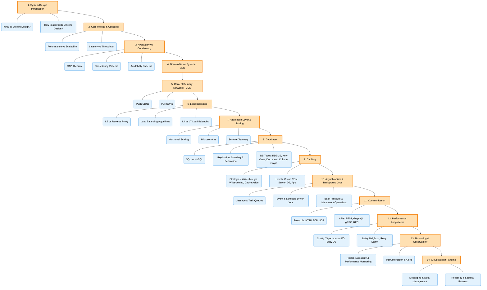

Here is the complete outline of the system design roadmap discussed in the video, divided into High-Level Design (HLD) and Low-Level Design (LLD):

**Prerequisites for System Design**
Before starting system design, it is highly recommended to have **hands-on development experience** (such as building projects or working at an SDE-1 level) so that the concepts do not feel purely theoretical. 

### **1. High-Level Design (HLD)**
HLD focuses on the overall architecture and components of a system without writing actual code. A key initial step is defining a system's **Functional Requirements** (the actual features users will interact with, like logging in or playing a video) and **Non-Functional Requirements** (system qualities like security, low latency, and scalability). 

The step-by-step outline to master HLD includes:
*   **Fundamentals:** Understanding serverless vs. serverful architecture (e.g., AWS Lambda vs. EC2), horizontal vs. vertical scaling, threads, request-response cycles, and how the internet/DNS works.
*   **Databases:** Knowing the differences between SQL and NoSQL databases (like MongoDB or Neo4j), in-memory databases, data replication, data migration, and **sharding** (horizontal data partitioning).
*   **Consistency and Availability:** Learning about the **CAP Theorem**, different levels of consistency (eventual, quorum, causal, linearizable), and isolation levels (read uncommitted, read committed, repeatable read). You must understand when to prioritize consistency (e.g., in payment systems) versus availability (e.g., in notification systems).
*   **Caching and CDNs:** Using caches (like Redis and Memcached) for frequently accessed data, understanding write and replacement policies (LRU, LFU), and utilizing **Content Delivery Networks (CDNs)** to quickly deliver static data.
*   **Networking:** Understanding TCP vs. UDP, differences in HTTP versions (1, 2, 3), WebSockets, and WebRTC for use cases like video streaming.
*   **Load Balancing:** Distributing traffic across multiple servers using algorithms like round-robin or least connections. This also includes learning about stateless vs. stateful balancing, consistent hashing, reverse proxies, and **rate limiting** to prevent DDoS attacks.
*   **Message Queues:** Handling non-critical, asynchronous tasks using the publisher-subscriber model with tools like Kafka or RabbitMQ.
*   **Architecture (Monoliths vs. Microservices):** Learning how to migrate from a monolith to microservices, avoiding single points of failure, preventing cascading failures, and utilizing containerization tools like Docker.
*   **Monitoring and Logging:** Tracking system metrics and detecting anomalies using tools like AWS CloudWatch, Prometheus, and Grafana to identify failures during high-traffic events.
*   **Security:** Implementing strong authentication and authorization using Tokens, OAuth, Access Control Lists (ACLs), and data encryption.
*   **Evaluating Trade-offs:** Being able to justify your design choices, such as choosing between Push vs. Pull architectures or balancing memory, latency, throughput, and accuracy.
*   **Practice:** Applying these concepts to design 10 popular large-scale systems, such as Netflix, WhatsApp, Amazon, Zoom, and Uber.

### **2. Low-Level Design (LLD)**
LLD is focused on machine coding, structuring code, creating models, and designing APIs. It tests your practical programming skills for smaller systems.

The step-by-step outline to master LLD includes:
*   **OOPs Fundamentals:** Mastering the four pillars of Object-Oriented Programming and the 5 **SOLID principles** (such as the Single Responsibility Principle and Open-Closed Principle).
*   **Design Patterns:** Understanding creational, structural, and behavioral design patterns.
*   **Concurrency and Thread Safety:** Managing data access in multi-threaded environments by understanding locking mechanisms, race conditions, synchronization, and the producer-consumer model.
*   **UML Diagrams:** Creating class and component diagrams (though this is sometimes an optional requirement depending on the company interviewing you).
*   **API Design and Clean Code:** Designing request/response object models, managing API versioning, following the DRY (Don't Repeat Yourself) principle, and avoiding messy "God classes".
*   **Practice Common Problems:** Writing code for smaller-scale applications like Tic-Tac-Toe, Chess, a URL shortener, or a notification system.

**Timeline for Preparation:**
If you already have active software engineering experience and use some of these tools daily, the roadmap will take about **2 to 3 months** to complete. If you are a beginner encountering these concepts for the first time, a realistic timeline is **4 to 6 months**.

You have put together a genuinely fantastic set of notes. They are highly detailed, cover a vast amount of ground, and use great real-world analogies. You already have a strong grasp on the core pillars of system design!

To answer your questions: **Yes, there are a few missing topics** that are critical for modern system design interviews and architecture. **No, your current flow is slightly disjointed.** It jumps back and forth between network layers, application layers, and foundational concepts (for example, "Background Jobs" is placed before networking, and "Asynchronism" is separated from it).

Here is a breakdown of what you should add to your study list, followed by a restructured, logical flow for your notes.

---

### Part 1: What Else You Need to Study (The Missing Pieces)

While your notes are excellent, you should research and add sections on the following concepts to make your knowledge complete:

**1. Real-Time Communication**
Your "Communication" section covers standard REST, GraphQL, and gRPC. You need to study how servers push data to clients without the client asking.

* **Study:** WebSockets, Server-Sent Events (SSE), and Long Polling.

**2. Distributed Hashing**
When you scale out databases or caches, how does the system know which server holds which piece of data without completely breaking when a server dies?

* **Study:** Consistent Hashing (and the concept of Virtual Nodes). This is a guaranteed interview topic.

**3. Capacity Planning (The Math)**
System design requires proving your architecture can handle the load using basic math.

* **Study:** Back-of-the-envelope estimation. Learn to calculate rough estimates for QPS (Queries Per Second), Bandwidth, and Storage requirements using standard numbers (e.g., 1 day = 86,400 seconds).

**4. Security & Identity**
You covered SSL well, but you need application-level security.

* **Study:** Authentication vs. Authorization, OAuth 2.0, JWT (JSON Web Tokens), and Rate Limiting (algorithms like Token Bucket or Leaky Bucket).

**5. Deep Dive into Message Brokers**
Your notes mention RabbitMQ and Kafka, but they work very differently.

* **Study:** The difference between a Message Queue (like RabbitMQ, where messages are deleted after reading) and an Event Stream (like Kafka, which acts as an append-only log).

**6. Object vs. Block vs. File Storage**
You mentioned AWS S3 for static assets, but cloud storage comes in three distinct flavors.
* **Study:** Object Storage (S3), Block Storage (EBS), and File Storage (EFS/NFS).

**7. Rate Limitte**
type of rate limitter
---

### Part 2: The Ideal Flow for Your Notes

Right now, your notes jump around. The best way to organize system design notes is to structure them either by **Foundational Theory** first, and then follow the **Lifecycle of a User Request** (from the edge of the network down to the database).

Here is how you should rearrange your existing sections (and where to insert the new topics):

#### Phase 1: Foundational Concepts (The Rules of the Game)

*This section covers the abstract concepts you need to know before designing anything.*

1. Introduction & Importance

2. Performance vs Scalability

3. Latency vs Throughput

4. Availability vs Consistency (The CAP Theorem)

5. Consistency Patterns (Strong, Eventual, Weak)

6. Availability Patterns (Active-Passive, Active-Active, Failover)

7. *(New)* Back-of-the-envelope Estimation

#### Phase 2: The Edge & Network (How the user reaches you)

*This section covers everything that happens before the request hits your actual application code.*
8. Domain Name System (DNS)
9. Content Delivery Networks (CDN)
10. Forward Proxy and Reverse Proxy
11. SSL Certification & Digital Signatures
12. Load Balancer (LB)

#### Phase 3: The Application Layer (How your code runs)

*This covers the compute layer.*
13. Application Layer (Microservices & Service Discovery)
14. Communication (TCP, UDP, HTTP, REST, GraphQL, gRPC)
15. *(New)* Real-Time Communication (WebSockets, SSE)
16. *(New)* Security, Identity & Rate Limiting
17. Idempotence

#### Phase 4: The Data Layer (How you store state)

*This is the heaviest part of system design.*
18. Databases (SQL vs NoSQL)
19. Database Architecture (Replication, Sharding, Federation, Denormalization)
20. Data Management (Valet Key, Materialized Views, Index Tables, Event Sourcing)
21. *(New)* Consistent Hashing
22. *(New)* Storage Types (Object, Block, File)
23. Caching (Strategies & Topologies)

#### Phase 5: Decoupling & Background Work (How you scale time)

*Moving heavy tasks off the main web thread.*
24. Asynchronism
25. Background Jobs (Event-Driven vs Schedule-Driven)
26. *(New)* Message Queues vs. Event Streaming (RabbitMQ vs Kafka)

#### Phase 6: Operations & Architecture (How you keep it alive)

*How to maintain the system and common industry blueprints.*
27. Cloud Design Patterns (Strangler Fig, CQRS, Sidecar, etc.)
28. Performance Antipatterns
29. Monitoring (Metrics, Logs, Traces)

If you restructure your document to follow this path, it will read like a cohesive story. You start with the physics of the internet (Latency/CAP), watch a user enter your network (DNS/Load Balancers), hit your code (Microservices), save their data (Databases), and finally, see how engineers monitor it all to make sure it doesn't break!