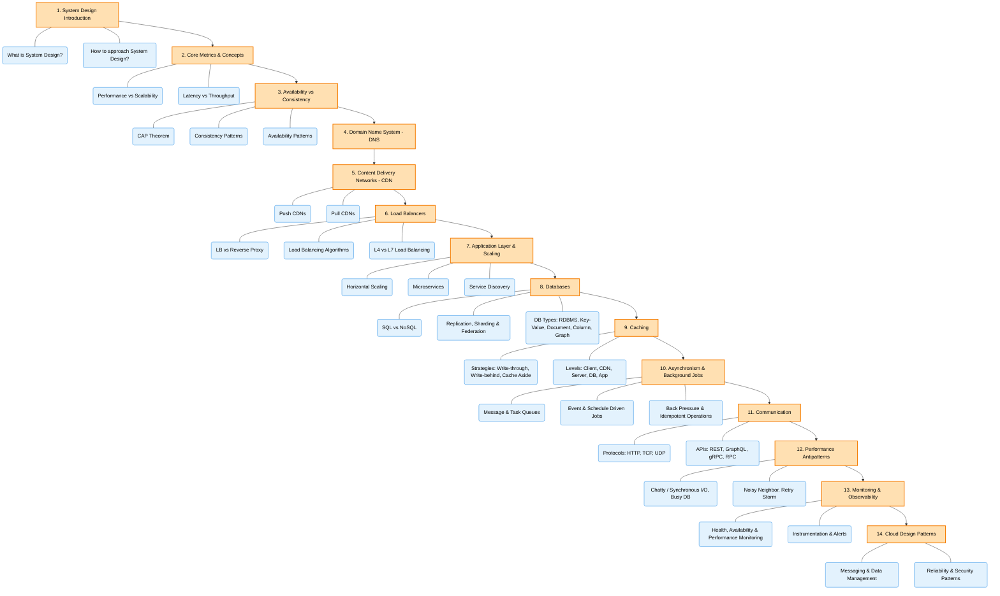

Here is the complete outline of the system design roadmap discussed in the video, divided into High-Level Design (HLD) and Low-Level Design (LLD):

**Prerequisites for System Design**
Before starting system design, it is highly recommended to have **hands-on development experience** (such as building projects or working at an SDE-1 level) so that the concepts do not feel purely theoretical. 

### **1. High-Level Design (HLD)**
HLD focuses on the overall architecture and components of a system without writing actual code. A key initial step is defining a system's **Functional Requirements** (the actual features users will interact with, like logging in or playing a video) and **Non-Functional Requirements** (system qualities like security, low latency, and scalability). 

The step-by-step outline to master HLD includes:
*   **Fundamentals:** Understanding serverless vs. serverful architecture (e.g., AWS Lambda vs. EC2), horizontal vs. vertical scaling, threads, request-response cycles, and how the internet/DNS works.
*   **Databases:** Knowing the differences between SQL and NoSQL databases (like MongoDB or Neo4j), in-memory databases, data replication, data migration, and **sharding** (horizontal data partitioning).
*   **Consistency and Availability:** Learning about the **CAP Theorem**, different levels of consistency (eventual, quorum, causal, linearizable), and isolation levels (read uncommitted, read committed, repeatable read). You must understand when to prioritize consistency (e.g., in payment systems) versus availability (e.g., in notification systems).
*   **Caching and CDNs:** Using caches (like Redis and Memcached) for frequently accessed data, understanding write and replacement policies (LRU, LFU), and utilizing **Content Delivery Networks (CDNs)** to quickly deliver static data.
*   **Networking:** Understanding TCP vs. UDP, differences in HTTP versions (1, 2, 3), WebSockets, and WebRTC for use cases like video streaming.
*   **Load Balancing:** Distributing traffic across multiple servers using algorithms like round-robin or least connections. This also includes learning about stateless vs. stateful balancing, consistent hashing, reverse proxies, and **rate limiting** to prevent DDoS attacks.
*   **Message Queues:** Handling non-critical, asynchronous tasks using the publisher-subscriber model with tools like Kafka or RabbitMQ.
*   **Architecture (Monoliths vs. Microservices):** Learning how to migrate from a monolith to microservices, avoiding single points of failure, preventing cascading failures, and utilizing containerization tools like Docker.
*   **Monitoring and Logging:** Tracking system metrics and detecting anomalies using tools like AWS CloudWatch, Prometheus, and Grafana to identify failures during high-traffic events.
*   **Security:** Implementing strong authentication and authorization using Tokens, OAuth, Access Control Lists (ACLs), and data encryption.
*   **Evaluating Trade-offs:** Being able to justify your design choices, such as choosing between Push vs. Pull architectures or balancing memory, latency, throughput, and accuracy.
*   **Practice:** Applying these concepts to design 10 popular large-scale systems, such as Netflix, WhatsApp, Amazon, Zoom, and Uber.

### **2. Low-Level Design (LLD)**
LLD is focused on machine coding, structuring code, creating models, and designing APIs. It tests your practical programming skills for smaller systems.

The step-by-step outline to master LLD includes:
*   **OOPs Fundamentals:** Mastering the four pillars of Object-Oriented Programming and the 5 **SOLID principles** (such as the Single Responsibility Principle and Open-Closed Principle).
*   **Design Patterns:** Understanding creational, structural, and behavioral design patterns.
*   **Concurrency and Thread Safety:** Managing data access in multi-threaded environments by understanding locking mechanisms, race conditions, synchronization, and the producer-consumer model.
*   **UML Diagrams:** Creating class and component diagrams (though this is sometimes an optional requirement depending on the company interviewing you).
*   **API Design and Clean Code:** Designing request/response object models, managing API versioning, following the DRY (Don't Repeat Yourself) principle, and avoiding messy "God classes".
*   **Practice Common Problems:** Writing code for smaller-scale applications like Tic-Tac-Toe, Chess, a URL shortener, or a notification system.

**Timeline for Preparation:**
If you already have active software engineering experience and use some of these tools daily, the roadmap will take about **2 to 3 months** to complete. If you are a beginner encountering these concepts for the first time, a realistic timeline is **4 to 6 months**.